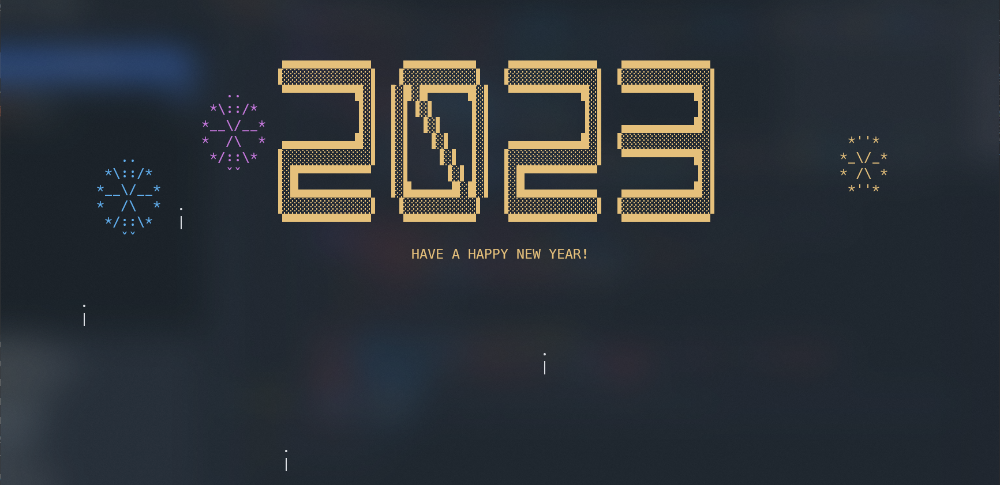

# Happy New Year!

## How it was born

Happy New Year (or HNY) is a 3 day Rust project. I had no experience with Rust before, so I wanted to take a quick look what it offers. As it was December the 25th when I downloaded Rust, a resonable project seemed to be something new year related! I have used ncurses before so I chose ncurses as my "graphical" library. All in all this was a great project and know I understand the concept of Rust a bit better.

## Usage

To try out HNY yourself, build the project with ``cargo build`` and then use the executable. You have to provide the new year. It is 2022 when I'm writing this readme, so I have to provide 2023 on December the 31st! So I would use the following command: ``cargo run 2023``.
